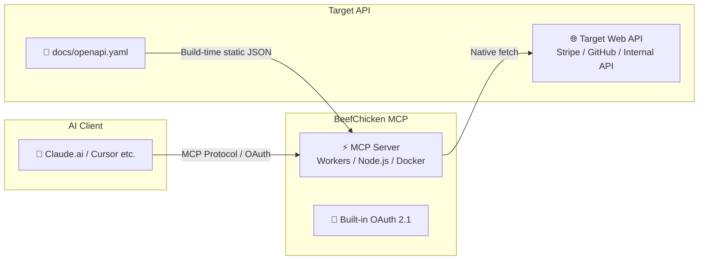

# BeefChicken MCP 🚀

<div align="center">
  <h3>Just drop in openapi.yaml. Turn any Web API into an MCP server instantly with zero code.</h3>
  <p><strong>Ultra-lightweight OpenAPI proxy server with built-in OAuth 2.1</strong></p>

  <p>English | <a href="README.md">日本語</a></p>
  
  [](https://deploy.workers.cloudflare.com/?url=https://github.com/Watanabebashi/BeefChicken-MCP)
  [](https://opensource.org/licenses/MIT)
  [](https://modelcontextprotocol.io/)
  [](https://workers.cloudflare.com/)
  [](https://www.docker.com/)
</div>

---

## 💡 What is this?

**BeefChicken MCP** is a general-purpose MCP server (proxy) that allows you to call any target Web API directly from **MCP clients** like Claude or Cursor simply by placing an `openapi.yaml` file.

No API-specific implementation code is required. It even includes a **lightweight OAuth 2.1 server** out of the box for clients that cannot specify API keys directly, allowing you to connect directly to **Claude.ai (Web)** as well.



---

## ⚡ Why BeefChicken MCP?

### ❌ Traditional Challenges
- You have to write tool definitions and request handlers manually in TypeScript or Python to build an MCP server.
- Modifying, testing, and redeploying code every time the API spec changes is a hassle.
- Using custom tools in Claude.ai (Web) is difficult due to the high barrier of building an OAuth 2.1 authentication server.

### ✅ With BeefChicken MCP
- 🧩 **0 Lines of Code**: Simply replace `docs/openapi.yaml` with the specification of the API you want to connect!
- 🔐 **Claude.ai (Web) Ready**: Built-in lightweight OAuth 2.1 server allows instant connection via Web Claude's custom connectors.
- ⚡️ **$0 Server Maintenance Cost**: Deploy to **Cloudflare Workers** in seconds (supports Docker / Node.js too). Yours for free within the free tier.
- 📦 **Ultra-lightweight & Zero Parsing Overhead**: Compiles OpenAPI specs into static JSON at build time. Zero runtime YAML parsing required.

---

## 📊 Comparison Matrix

| Feature / Aspect | Manual Implementation (TS/Python SDK) | General MCP Frameworks (FastMCP etc.) | **BeefChicken MCP** |
|---|:---:|:---:|:---:|
| **Code Writing** | Required (High) | Required (Low) | **Not required (0 lines / Just drop YAML)** |
| **OpenAPI Support** | ❌ Manual conversion needed | ⚠️ Requires handler implementation | **✅ File replacement only** |
| **Built-in OAuth 2.1 Server** | ❌ Custom build needed | ❌ Custom build needed | **✅ Built-in (Claude Web ready)** |
| **Cloudflare Workers** | ⚠️ Requires adjustments | ⚠️ Requires adjustments | **✅ Fully supported (Button deploy)** |
| **Runtime Footprint** | - | Medium to Large | **Minimal (Static JSON compilation)** |

---

## ✨ Key Features

- 🧩 **Config-driven setup**: Turn any Web API into MCP tools without writing a single line of code.
- 🎯 **Dedicated proxy design**: Eliminates complex handler logic to act strictly as a pure proxy as specified by the spec.
- 📦 **Static JSON compilation**: Excludes runtime YAML parsers and `$ref` resolution logic to minimize Worker bundle size.
- 🔌 **Native `fetch` relay**: Direct response relay without wrapping HTTP client libraries.
- 🛡️ **Stateless & Robust**: Operates in `responseMode: 'json'` mode without relying on long-lived SSE connections. Highly resilient against timeout limits.

> **⚠️ Important Notice Before Production Use**:
> This server itself does not have built-in rate limiting. When exposing publicly, control rate limits using platform-level tools like Cloudflare [Rate Limiting Rules](https://developers.cloudflare.com/waf/rate-limiting-rules/) or reverse proxies. The bundled OAuth 2.1 server is a lightweight implementation; refer to [Auth Docs](docs/oauth.en.md) for details.

---

## 🚀 Quick Start

### 1. Place the API Specification
Replace `docs/openapi.yaml` with the OpenAPI 3.0 specification of the API you want to connect.

> **💡 Hint**: Standard OpenAPI specs for services like Stripe or GitHub can be obtained from official repositories or [APIs.guru](https://github.com/APIs-guru/openapi-directory).

```bash
npm install
npm run generate   # Parses docs/openapi.yaml and automatically generates src/generated/tools.json
```

### 2. Deploy / Run

**For Cloudflare Workers:**
```bash
npx wrangler deploy
```
Upon success, `https://beefchicken-mcp.<your-subdomain>.workers.dev/mcp` will be issued (see [Deployment Guide](docs/deploy.en.md) for details like D1 setup).

**For Node.js:**
```bash
API_BASE_URL=https://api.example.com npm run node:dev
```

**For Docker:**
```bash
docker build -t beefchicken-mcp .
docker run -p 3000:3000 \
  -e HOST=0.0.0.0 \
  -e ALLOWED_HOSTS=127.0.0.1,localhost \
  -e API_BASE_URL=https://api.example.com \
  beefchicken-mcp
```

### 3. Connect from Client
Configure your MCP client with the issued URL along with an `Authorization: Bearer <TARGET_API_KEY>` header.

---

## 📚 Documentation

| Topic | Description |
|---|---|
| 🔑 [Auth / OAuth](docs/oauth.en.md) | API key authentication method & design philosophy, connecting custom connectors for claude.ai (Web) |
| ☁️ [Deploy](docs/deploy.en.md) | Deployment instructions for Cloudflare Workers / Node.js / Docker |
| ⚙️ [Environment Variables (Env)](docs/environment.en.md) | Complete reference for all configuration items |
| 🛠 [Development](docs/development.en.md) | Local execution, test procedures, OpenAPI updates, and security checks |

---

## 📜 License

MIT License. See [LICENSE](LICENSE) for details.
