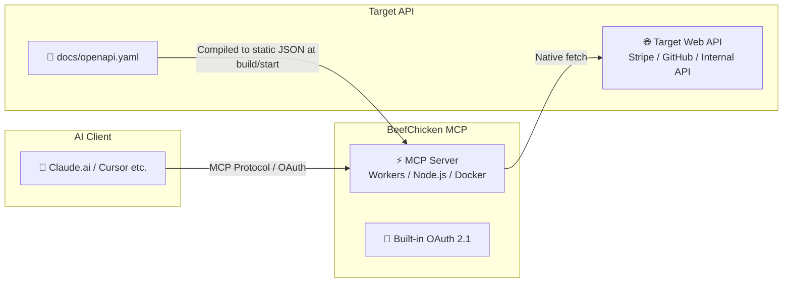

# BeefChicken MCP 🚀

<div align="center">
  <h3>Just drop in openapi.yaml. Turn any Web API into an MCP server instantly with zero code.</h3>
  <p><strong>Ultra-lightweight OpenAPI proxy server with built-in OAuth 2.1</strong></p>

  <p>English | <a href="README.md">日本語</a></p>
  
  [](https://deploy.workers.cloudflare.com/?url=https://github.com/Watanabebashi/BeefChicken-MCP)
  [](https://opensource.org/licenses/MIT)
  [](https://modelcontextprotocol.io/)
  [](https://workers.cloudflare.com/)
  [](https://www.docker.com/)
  [](https://www.npmjs.com/package/beefchicken-mcp)
  [](https://www.npmjs.com/package/beefchicken-mcp)
</div>

---

## 💡 What is this?

**BeefChicken MCP** is a general-purpose MCP server (proxy) that allows you to call any target Web API directly from **MCP clients** like Claude or Cursor simply by placing an `openapi.yaml` file.

No API-specific implementation code is required. It even includes a **lightweight OAuth 2.1 server** out of the box for clients that cannot specify API keys directly, allowing you to connect directly to **Claude.ai (Web)** as well.



---

## ⚡ Why BeefChicken MCP?

### ❌ Traditional Challenges
- You have to write tool definitions and request handlers manually in TypeScript or Python to build an MCP server.
- Modifying, testing, and redeploying code every time the API spec changes is a hassle.
- Using custom tools in Claude.ai (Web) is difficult due to the high barrier of building an OAuth 2.1 authentication server.

### ✅ With BeefChicken MCP
- 🧩 **0 Lines of Code**: Simply replace `docs/openapi.yaml` with the specification of the API you want to connect!
- 🔐 **Claude.ai (Web) Ready**: Built-in lightweight OAuth 2.1 server allows instant connection via Web Claude's custom connectors.
- ⚡️ **$0 Server Maintenance Cost**: Deploy to **Cloudflare Workers** in seconds (supports Docker / Node.js too). Yours for free within the free tier.
- 📥 **No deployment at all, if you don't need one**: For local clients like Claude Desktop there is nothing to clone and nothing to build — run `npx beefchicken-mcp` straight from [npm](https://www.npmjs.com/package/beefchicken-mcp).
- 📦 **Ultra-lightweight & Zero Parsing Overhead**: Compiles OpenAPI specs into static JSON at build time (Workers), container startup (Docker), or a pre-deploy `npm run generate` (Node.js). No YAML parsing while handling requests.

---

## 📊 Comparison Matrix

| Feature / Aspect | Manual Implementation (TS/Python SDK) | General MCP Frameworks (FastMCP etc.) | **BeefChicken MCP** |
|---|:---:|:---:|:---:|
| **Code Writing** | Required (High) | Required (Low) | **Not required (0 lines / Just drop YAML)** |
| **OpenAPI Support** | ❌ Manual conversion needed | ⚠️ Requires handler implementation | **✅ File replacement only** |
| **Built-in OAuth 2.1 Server** | ❌ Custom build needed | ❌ Custom build needed | **✅ Built-in (Claude Web ready)** |
| **Cloudflare Workers** | ⚠️ Requires adjustments | ⚠️ Requires adjustments | **✅ Fully supported (Button deploy)** |
| **Runtime Footprint** | - | Medium to Large | **Minimal (Static JSON compilation)** |

---

## ✨ Key Features

- 🧩 **Config-driven setup**: Turn any Web API into MCP tools without writing a single line of code.
- 🎯 **Dedicated proxy design**: Eliminates complex handler logic to act strictly as a pure proxy as specified by the spec.
- 📦 **Static JSON compilation**: Excludes runtime YAML parsers and `$ref` resolution logic to minimize Worker bundle size.
- 🔌 **Native `fetch` relay**: Direct response relay without wrapping HTTP client libraries.
- 🛡️ **Stateless & Robust**: Operates in `responseMode: 'json'` mode without relying on long-lived SSE connections. Highly resilient against timeout limits.
- 📦 **Four distribution formats**: Cloudflare Workers, Node.js, a Docker image on GHCR, and an npm CLI (`npx beefchicken-mcp`) — pick whichever fits.

> **⚠️ Important Notice Before Production Use**:
> This server itself does not have built-in rate limiting. When exposing publicly, control rate limits using platform-level tools like Cloudflare [Rate Limiting Rules](https://developers.cloudflare.com/waf/rate-limiting-rules/) or reverse proxies. The bundled OAuth 2.1 server is a lightweight implementation; refer to [Auth Docs](docs/oauth.en.md) for details.

---

## 🚀 Quick Start

### 1. Place the API Specification
Replace `docs/openapi.yaml` with the OpenAPI 3.0 specification of the API you want to connect.

> **💡 Hint**: Standard OpenAPI specs for services like Stripe or GitHub can be obtained from official repositories or [APIs.guru](https://github.com/APIs-guru/openapi-directory).

```bash
npm install
npm run generate   # Parses docs/openapi.yaml and automatically generates src/generated/tools.json
```

### 2. Deploy / Run

**For a local MCP client (Claude Desktop, etc.) — the shortest path:**
```bash
npx beefchicken-mcp --openapi /absolute/path/to/openapi.yaml
```
It ships as an [npm package](https://www.npmjs.com/package/beefchicken-mcp), so there is nothing to clone and nothing to deploy (this path also skips the `npm install` / `npm run generate` of step 1 — the spec you point at is parsed in memory on every startup). See [step 4](#4-use-directly-from-a-local-mcp-client-claude-desktop-etc) for the exact client configuration.

**For Cloudflare Workers:**
```bash
npx wrangler deploy
```
Upon success, `https://beefchicken-mcp.<your-subdomain>.workers.dev/mcp` will be issued (see [Deployment Guide](docs/deploy.en.md) for details like D1 setup).

**For Node.js:**
```bash
API_BASE_URL=https://api.example.com npm run node:dev
```

**For Docker:**
```bash
docker run -p 3000:3000 \
  -e HOST=0.0.0.0 \
  -e ALLOWED_HOSTS=127.0.0.1,localhost \
  -e API_BASE_URL=https://api.example.com \
  -v $(pwd)/docs/openapi.yaml:/app/docs/openapi.yaml:ro \
  ghcr.io/watanabebashi/beefchicken-mcp
```
The image is published on [GHCR](https://github.com/Watanabebashi/BeefChicken-MCP/pkgs/container/beefchicken-mcp) — no build step required. Mount your own `openapi.yaml` and the container parses it into `tools.json` on startup (omit the mount to use the bundled sample spec). Available tags: `latest` (newest release), `vX.Y.Z` (pinned version), and `edge` (latest build from `main`). To try local changes, you can still build with `docker build -t beefchicken-mcp .` as before.

### 3. Connect from Client
Configure your MCP client with the issued URL along with an `Authorization: Bearer <TARGET_API_KEY>` header.

### 4. Use directly from a local MCP client (Claude Desktop, etc.)

For MCP clients that launch the server as a local subprocess (Claude Desktop, Claude Code), you can connect via `npx` with no deployment at all. Add this to your client config (e.g. `claude_desktop_config.json`):

```json
{
  "mcpServers": {
    "my-api": {
      "command": "npx",
      "args": ["beefchicken-mcp", "--openapi", "/absolute/path/to/your-api-openapi.yaml"],
      "env": {
        "API_KEY": "<TARGET_API_KEY>",
        "API_BASE_URL": "https://api.example.com"
      }
    }
  }
}
```

- `--openapi` points to your target API's OpenAPI spec (absolute path); tool definitions are generated in memory on every startup, so no prior `npm run generate` step is needed. A bare positional path (`["beefchicken-mcp", "/absolute/path/to/your-api-openapi.yaml"]`) works the same way. With no path at all, it falls back to the pre-generated `src/generated/tools.json` inside a cloned repo (the process exits with an error if neither is available). There is deliberately no cwd-relative default spec: the cwd an MCP client launches the subprocess with is unpredictable, so always pass an absolute path.
- `API_KEY` is required. stdio mode bypasses the built-in OAuth server entirely and forwards `API_KEY`'s value straight through as the target API's `Authorization: Bearer` token.
- To register a locally cloned checkout instead, set `command` to `npx` and `args` to `["tsx", "src/stdio.ts", "--openapi", "./docs/openapi.yaml"]` with the client's `cwd` (if supported) pointed at the repo root — this runs the same `src/stdio.ts` entrypoint. Don't use `npm run stdio` for client configs: npm's own banner output gets mixed into stdout and breaks the stdio JSON-RPC framing. It's fine for a one-off manual check in your terminal, just not as the client's launch command.

---

## 📚 Documentation

| Topic | Description |
|---|---|
| 🔑 [Auth / OAuth](docs/oauth.en.md) | API key authentication method & design philosophy, connecting custom connectors for claude.ai (Web) |
| ☁️ [Deploy](docs/deploy.en.md) | Deployment instructions for Cloudflare Workers / Node.js / Docker |
| ⚙️ [Environment Variables (Env)](docs/environment.en.md) | Complete reference for all configuration items |
| 🛠 [Development](docs/development.en.md) | Local execution, test procedures, OpenAPI updates, and security checks |

---

## 📜 License

MIT License. See [LICENSE](LICENSE) for details.
