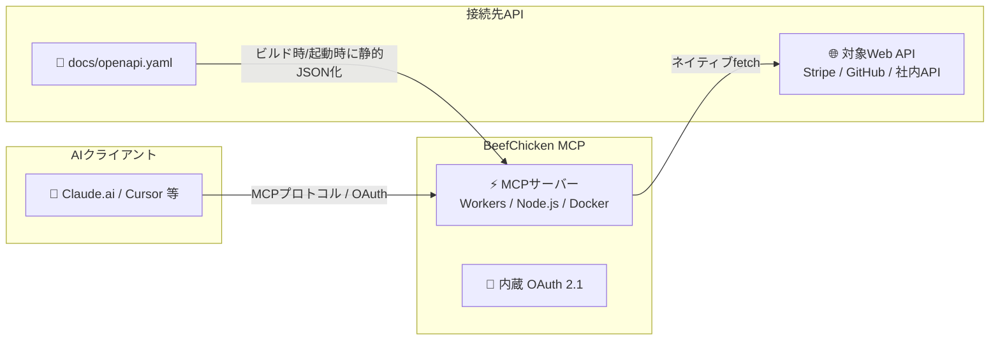

# BeefChicken MCP 🚀

<div align="center">
  <h3>openapi.yaml を1枚置くだけ。コード記述ゼロでどんなWeb APIも即座にMCPサーバー化</h3>
  <p><strong>簡易OAuth 2.1内蔵の超軽量OpenAPIプロキシサーバー</strong></p>

  <p><a href="README.en.md">English</a> | 日本語</p>
  
  [](https://deploy.workers.cloudflare.com/?url=https://github.com/Watanabebashi/BeefChicken-MCP)
  [](https://opensource.org/licenses/MIT)
  [](https://modelcontextprotocol.io/)
  [](https://workers.cloudflare.com/)
  [](https://www.docker.com/)
</div>

---

## 💡 これは何？

**BeefChicken MCP** は、任意の `openapi.yaml` を配置するだけで、対象の Web API を Claude や Cursor などの **MCPクライアント** から直接呼び出せるようにする汎用 MCP サーバー（プロキシ）です。

特定のAPIに依存する実装コードは一切不要。APIキーを直接指定できないクライアント向けに **簡易 OAuth 2.1 サーバー** まで同梱しているため、**Claude.ai (Web版)** にもそのまま接続できます。



---

## ⚡ なぜ BeefChicken MCP なのか？

### ❌ 従来の課題
- MCPサーバーを作るために、TypeScriptやPythonでツール定義やリクエストハンドラをガリガリ書く必要がある。
- APIの仕様変更のたびにコードを修正・テストして再デプロイするのが大変。
- Claude.ai (Web版) で自作ツールを使いたいが、OAuth 2.1 認証サーバー構築のハードルが高い。

### ✅ BeefChicken MCP なら
- 🧩 **コード記述 0 行**: `docs/openapi.yaml` を繋ぎたいAPIの仕様書に差し替えるだけ！
- 🔐 **Claude.ai (Web版) 即対応**: 簡易 OAuth 2.1 サーバー内蔵で、Web版Claudeのカスタムコネクタも一発接続。
- ⚡️ **サーバー維持費 0 円**: **Cloudflare Workers** に数秒でデプロイ（Docker / Node.js にも対応）。無料枠内ならタダでMCPサーバーがあなたのものに。
- 📦 **超軽量＆ゼロパースオーバーヘッド**: OpenAPI 仕様書はビルド時（Workers）・起動時（Docker）・デプロイ前の `npm run generate`（Node.js）のいずれかで静的 JSON へ変換済み。リクエスト処理中の YAML パースは一切不要。

---

## 📊 他の手段との比較

| 機能 / 特徴 | 手動実装 (TS/Python SDK) | 一般的なMCPフレームワーク (FastMCP等) | **BeefChicken MCP** |
|---|:---:|:---:|:---:|
| **コード記述** | 必要 (多) | 必要 (少) | **不要 (0行・YAML置くだけ)** |
| **OpenAPI対応** | ❌ 要手動変換 | ⚠️ 要ハンドラ実装 | **✅ ファイル差し替えのみ** |
| **OAuth 2.1 サーバー内蔵** | ❌ 自作が必要 | ❌ 自作が必要 | **✅ 内蔵 (Claude Web即対応)** |
| **Cloudflare Workers** | ⚠️ 要調整 | ⚠️ 要調整 | **✅ 完全対応 (ボタンデプロイ)** |
| **実行時フットプリント** | - | 中〜大 | **極小 (静的JSON化)** |

---

## ✨ 主な特徴

- 🧩 **設定ファイルの差し替えだけで完結**: コードを1行も書かずに任意の Web API を MCP ツール化。
- 🎯 **専用プロキシに徹した設計**: 複雑なハンドラ記述を排除し、仕様書通りの純粋なプロキシとして動作。
- 📦 **静的JSON変換**: 実行時の YAML パーサーや `$ref` 解決ロジックを非搭載にし、Worker バンドルサイズを最小化。
- 🔌 **ネイティブ `fetch` 中継**: 余計な HTTP クライアントライブラリを挟まずレスポンスをダイレクト中継。
- 🛡️ **Stateless & Robust**: SSE 長時間保持に依存しない `responseMode: 'json'` 構成。タイムアウト制限に強い堅牢設計。

> **⚠️ 本番公開前の注意点**:
> 本サーバー自体にはレート制限がありません。公開時は Cloudflare の [Rate Limiting Rules](https://developers.cloudflare.com/waf/rate-limiting-rules/) やリバースプロキシ等で制御してください。また同梱の OAuth 2.1 サーバーは簡易実装です。詳細は [認証ドキュメント](docs/oauth.md) を確認してください。

---

## 🚀 クイックスタート

### 1. 仕様書の配置
`docs/openapi.yaml` を繋ぎたい API の OpenAPI 3.0 仕様書に差し替えます。

> **💡 ヒント**: Stripe や GitHub などの標準 OpenAPI は公式や [APIs.guru](https://github.com/APIs-guru/openapi-directory) 等から入手できます。

```bash
npm install
npm run generate   # docs/openapi.yaml を解析し、src/generated/tools.json を自動生成
```

### 2. デプロイ / 実行

**Cloudflare Workers の場合:**
```bash
npx wrangler deploy
```
成功すると `https://beefchicken-mcp.<あなたのサブドメイン>.workers.dev/mcp` が発行されます（D1設定等の詳細は [デプロイ手順](docs/deploy.md) 参照）。

**Node.js の場合:**
```bash
API_BASE_URL=https://api.example.com npm run node:dev
```

**Docker の場合:**
```bash
docker run -p 3000:3000 \
  -e HOST=0.0.0.0 \
  -e ALLOWED_HOSTS=127.0.0.1,localhost \
  -e API_BASE_URL=https://api.example.com \
  -v $(pwd)/docs/openapi.yaml:/app/docs/openapi.yaml:ro \
  ghcr.io/watanabebashi/beefchicken-mcp
```
イメージは [GHCR](https://github.com/Watanabebashi/BeefChicken-MCP/pkgs/container/beefchicken-mcp) から配布されており、ビルドは不要です。自分の `openapi.yaml` をマウントすると、コンテナ起動時にそれを解析して `tools.json` を生成します（マウントしない場合は同梱のサンプル仕様書が使われます）。タグは `latest`（最新リリース）・`vX.Y.Z`（特定バージョン固定）・`edge`（main ブランチの最新ビルド）から選べます。ローカルの変更を試したい場合は、従来どおり `docker build -t beefchicken-mcp .` でビルドできます。

### 3. クライアントから接続
発行された URL に対し `Authorization: Bearer <対象APIのAPIキー>` ヘッダーを付けて MCP クライアントに設定します。

---

## 📚 ドキュメント

| トピック | 内容 |
|---|---|
| 🔑 [認証](docs/oauth.md) | APIキーの送信方法・設計方針、claude.ai Web版向けカスタムコネクタの接続方法 |
| ☁️ [デプロイ](docs/deploy.md) | Cloudflare Workers / Node.js / Docker へのデプロイ手順 |
| ⚙️ [環境変数](docs/environment.md) | 全設定項目のリファレンス |
| 🛠 [開発](docs/development.md) | ローカル実行・テスト手順・OpenAPI更新・安全性チェック |

---

## 📜 ライセンス

MIT License. 詳細は [LICENSE](LICENSE) を参照してください。
